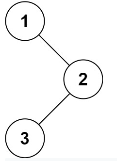

# Description

Given the *root* of a binary tree, return the inorder traversal of its nodes values.

**Example 1:**



```
Input: root = [1,null,2,3]
Output: [1,3,2]
```

**Example 2:**

```
Input: root = []
Output: []
```

**Example 3:**

```
Input: root = [1]
Output: [1]
```

# Solution

```python
# Definition for a binary tree node.
# class TreeNode:
#     def __init__(self, val=0, left=None, right=None):
#         self.val = val
#         self.left = left
#         self.right = right
class Solution:
    def helper(self, root, res):
        if root is None:
            return

        if root.left is not None:
            self.helper(root.left, res)
            
        res.append(root.val)

        if root.right is not None:
            self.helper(root.right, res)

    def inorderTraversal(self, root: TreeNode) -> List[int]:
        res = []
        self.helper(root, res)
        return res
```

```
Time complexity: O(N)
Space complexity: O(N)
```

[Solution link](https://leetcode.com/submissions/detail/515076093/)
