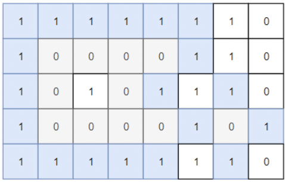
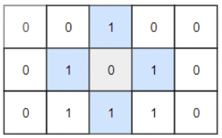

# Description

Given a 2D grid consists of 0s (land) and 1s (water).  An island is a maximal 4-directionally connected group of 0s and a closed island is an island totally (all left, top, right, bottom) surrounded by 1s.

Return the number of closed islands.

**Example 1:**



```
Input: grid = [[1,1,1,1,1,1,1,0],[1,0,0,0,0,1,1,0],[1,0,1,0,1,1,1,0],[1,0,0,0,0,1,0,1],[1,1,1,1,1,1,1,0]]
Output: 2
Explanation: 
Islands in gray are closed because they are completely surrounded by water (group of 1s).
```

**Example 2:**



```
Input: grid = [[0,0,1,0,0],[0,1,0,1,0],[0,1,1,1,0]]
Output: 1
```

**Example 3:**

```
Input: grid = [[1,1,1,1,1,1,1],
               [1,0,0,0,0,0,1],
               [1,0,1,1,1,0,1],
               [1,0,1,0,1,0,1],
               [1,0,1,1,1,0,1],
               [1,0,0,0,0,0,1],
               [1,1,1,1,1,1,1]]
Output: 2
```

# Solution

=== "Python3"

```python3
class Solution:
    def closedIsland(self, grid: List[List[int]]) -> int:
        def dfs(i, j):
            
            if grid[i][j] == -1 or grid[i][j] == 1:
                return 1
            
            if i < 1 or j < 1 or i >= N-1 or j >= M-1:
                return 0
        
            grid[i][j] = -1
            
            bottom = dfs(i-1,j)
            left = dfs(i,j-1)
            top = dfs(i+1, j)
            right = dfs(i,j+1)
            
            return bottom and left and top and right
        
        N, M = len(grid), len(grid[0])
        count = 0
        for i in range(1, N-1):
            for j in range(1, M-1):
                if grid[i][j] == 0 and grid[i][j] > -1 and dfs(i, j):
                    count += 1
                    
        return count
```

```
Time complexity: O(N^2)
Space complexity: O(N^2)
```
